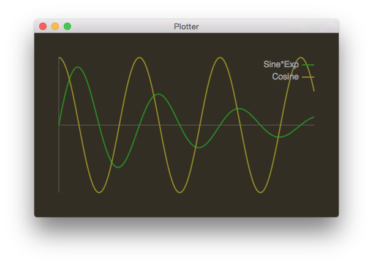

# Plotter

Mac OS app to plot numbers fed to it through standard input.

Usage:

```sh
% python example.py | Plotter
```

The data must have one line per data point, and a data point can
have any number of values, separated by spaces or tabs:

    1.1 5 234
    1.2 4.9 254
    ...

Each column represents a series, which will be drawn horizontally in
a plot. For example, this program (see `example.py`):

```python
import math

print("Sine*Exp\tCosine")

t = 0
while t < 20:
    print(math.sin(t)*math.exp(-t*0.1), math.cos(t))
    t += 0.1
```

generates this plot:



Click the plot to show the value at the mouse position.

You can specify a header as the first row. It is auto-detected by looking
for alphabetic characters. Header fields _must_ be separated by tabs.

    Growth\tAge\tDollars
    1.1 5 234
    1.2 4.9 254
    ...

The header will be used as series titles in the legend. Headers can
optionally specify comma-separated options in brackets:

    Growth [red]\tAge [hide]\tDollars [purple,right]
    1.1 5 234
    1.2 4.9 254
    ...

The options are:

- A color (`blue`, `brown`, `cyan`, `gray`, `green`, `magenta`, `orange`,
  `purple`, `red`, `white`, or `yellow`). If a color is unspecified, a default
  color is chosen.
- Whether to associate the series with the left axis (`left`) or right axis (`right`). The
  default is `left`. This can be useful if the plot contains values of different units
  or vastly different ranges.
- Whether to hide the series altogether (`hide`). This is useful if you want to omit the
  series from the plot without modifying your program much.
- Whether the series should be the domain (`domain`). If this flag is specified, then the
  series will be used for the horizontal axis. If missing, the domain will implicitly
  be the line number (starting with 1).
- Whether to display the derivative of the data (`derivative`). This can be specified multiple
  times to compute the second derivative, third derivative, and so on. For each derivative,
  the title in the legend has an apostrophe appended to it.
- Whether to draw a log plot (`log`). This currently only works on the domain. All values
  must be positive for log plots.
- Whether to domain values should be considered to be years (`date`). This draws the
  four-digit numbers as "2018" instead of "2,018". Does not apply to ranges.
- Whether to always show zero in the axis (`zero`). For example, if the range
  or domain of a series is 400 to 410, then normally its axis would go from 400
  to 410. This option will cause the axis to go from 0 to 410.

# Building

To build it, run `make`. You'll find the app in `build/Plotter.app`. Copy that
somewhere and either add its `Contents/MacOS` subdirectory to your path, or
create an alias for the binary:

```sh
alias Plotter=$PLOTTER_APP_DIR/Contents/MacOS/Plotter
```

# License

Copyright &copy; Lawrence Kesteloot, [MIT license](LICENSE).
