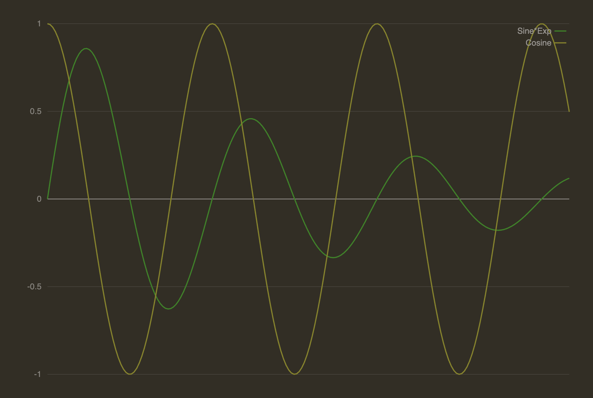

# Plotter

Mac OS app to plot numbers in a CSV-like file.

Usage:

```sh
% python3 example.py > data.txt
% Plotter data.txt
```

The data must have one line per data point, and a data point can
have any number of values, separated by spaces or tabs:

    1.1 5 234
    1.2 4.9 254
    ...

Each column represents a series, which will be drawn horizontally in
a plot. For example, this program (see `example.py`):

```python
import math

print("Sine*Exp\tCosine")

t = 0
while t < 20:
    print(math.sin(t)*math.exp(-t*0.1), math.cos(t))
    t += 0.1
```

generates this plot:



Click the plot to show the domain value at the mouse position.

You can specify a header as the first row. It is auto-detected by looking
for alphabetic characters. Header fields _must_ be separated by tabs.

    Growth\tAge\tDollars
    1.1 5 234
    1.2 4.9 254
    ...

The header will be used as series titles in the legend. Headers can
optionally specify comma-separated options in brackets:

    Growth [red]\tAge [hide]\tDollars [purple,right]
    1.1 5 234
    1.2 4.9 254
    ...

The options are:

- A color (`blue`, `brown`, `cyan`, `gray`, `green`, `magenta`, `orange`,
  `purple`, `red`, `white`, or `yellow`). If a color is unspecified, a default
  color is chosen.
- Whether to associate the series with the left axis (`left`) or right axis (`right`). The
  default is `left`. This can be useful if the plot contains values of different units
  or vastly different ranges.
- Whether to hide the series altogether (`hide`). This is useful if you want to omit the
  series from the plot without modifying your program much.
- Whether the series should be the domain (`domain`). If this flag is specified, then the
  series will be used for the horizontal axis. If missing, the domain will implicitly
  be the line number (starting with 1).
- Whether to display the derivative of the data (`derivative`). This can be specified multiple
  times to compute the second derivative, third derivative, and so on. For each derivative,
  the title in the legend has an apostrophe appended to it.
- Whether to draw a log plot (`log`). This currently only works on the domain. All values
  must be positive for log plots.
- Whether domain values should be considered to be years (`date`). This draws the
  four-digit numbers as "2018" instead of "2,018". Does not apply to ranges.
- Whether to always show zero in the axis (`zero`). For example, if the range
  or domain of a series is 400 to 410, then normally its axis would go from 400
  to 410. This option will cause the axis to go from 0 to 410.

# Usage

Specify one or more filenames on the command line, each of which opens in its
own window:

```sh
% Plotter data.txt other.txt
```

Use <kbd>&#x2318;R</kbd> (File > Reload) to re-read a file after regenerating it,
and <kbd>&#x2318;O</kbd> (File > Open) to open more.

# Building

Run `make`. You'll find the app in `build/mac-arm64/Plotter.app`. Copy that
somewhere and either add its `Contents/MacOS` subdirectory to your path, or
create an alias for the binary:

```sh
alias Plotter=$PLOTTER_APP_DIR/Contents/MacOS/Plotter
```

Run `make check` to typecheck and run the tests, and `make run FILE=data.txt` to
run without packaging.

`icon/Plotter.icns` is committed, and `make app` uses it as-is rather than
regenerating it, so building never depends on opening a window. After changing
`icon/draw-icon.ts`, run `make icon` and commit the new `.icns`.

# Source layout

- `src/core/` — parsing the input, computing derivatives, and choosing grid
  lines. Plain TypeScript with no dependency on Electron, and where nearly all
  the behavior described above lives. This is what the tests in `test/` cover.
- `src/main/` — the Electron main process: the command line, the windows, and
  the menu.
- `src/renderer/` — draws the plot on a canvas.
- `icon/` — draws the app icon and packages it as an `.icns`.

# License

Copyright &copy; Lawrence Kesteloot, [MIT license](LICENSE).
